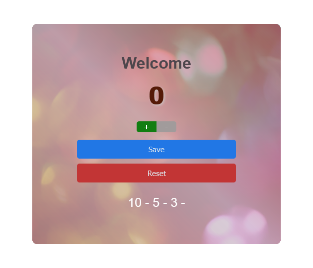

# The Number-Counter Using JavaScript
It records and save numbers from 0-10 in batches. 

## Acknowledgements
This project is inspired from [Freecode Camp](https://youtu.be/jS4aFq5-91M) tutorial on JavaScript on Youtube

## Demo

Live: [https://thepran.github.io/counter-js/](https://thepran.github.io/counter-js/)

## Feedback

If you have any feedback, please reach out to us at negipranaysingh@gmail.com

## 🛠 Skills
Javascript, HTML, CSS...

## Screenshots

